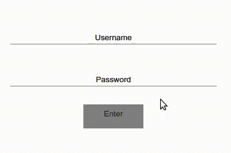
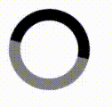
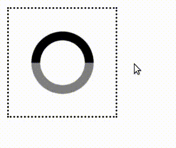
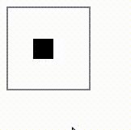
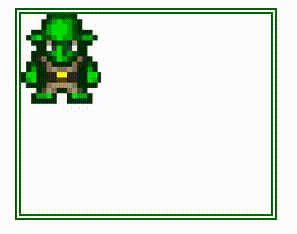

## CSTSI - 4SEM - LPAW - Atividades Aula 01

Exercícios sobre as propriedades de transição e animação do CSS3. Todos os exercícios devem ser feitos apenas com HTML e CSS, não utilize javascript.

1) Utilize a pseudo-classe :hover e :focus para aplicar transições nos elementos do formulário de login de acordo com os efeitos mostrados na figura abaixo:



Use a seguinte estrutura HTML:
```html
<div class="container">
        <div class="input-group">
            <label for="login">Username:</label>
            <input id="login" type="text" name="login" placeholder="Username">
        </div>
        <div class="input-group">
            <label for="password">Password:</label>
            <input id="password" type="password" name="login" placeholder="Password">
        </div>
        <div class="button-group">
            <button>Enter</button>
        </div>
    </div>
```

2) Use apropriedade animation para criar uma animação de carregamento (loader) baseada no gif abaixo:



 Não há restrição quanto a tempo, tamanho, cores ou proporções, apens a ideia geral da animação, ou seja, um círculo animado com duas cores pelo menos.


3)  Use a pseudo-classe :hover e a propriedade animation para criar uma animação baseada na anterior, mas que será executada somente quando o mouse estiver na área interna ao quadrado pontilhado, como mostra a figura abaixo:

 

4) Modifique o  *[exemplo 12](https://codepen.io/g1ll/pen/ExQMBgN)*, visto em aula, para que a animação se comporte como a imagem gif abaixo:



5) Crie a animação de barra de carregamento (load bar) conforme a ilustração abaixo: 


6) Modifique o exemplo de sprites do duende (goblin) ajustando os valores para uma imagem dez vezes maior ([big-goblin](../aula02-css3-animations/img/goblin_big.png), e reproduza a animação da figura abaixo:



A animação não deverá estar em loop, até porque será preciso criar mais de uma animação e sincronizá-las.

Use esta imagem: [big-goblin](https://github.com/g1ll/cstsi-4sem-lpaw/blob/main/aula02-css3-animations/img/goblin_big.png) e esta estrutura HTML:

```html
<div class="container">
    <div class="goblin-down"></div>
    <div class="goblin-right"></div>
    <div class="goblin-up"></div>
    <div class="goblin-left"></div>
</div>
```