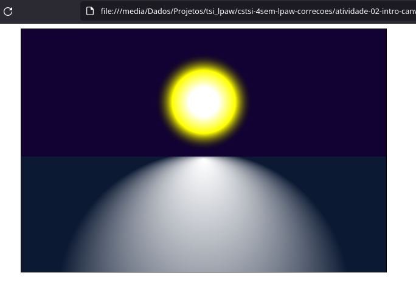

## CSTSI - 4SEM - LPAW - Atividades Aula 03

Exercícios de introdução a tag canvas.

1) Escreva uma função chamada **quad** com a assinatura conforme a figura abaixo:


A função deverá imprimir um quadrado exato de acordo com os seguintes parâmetros:

* **ctx** -> objeto de desenho
* **x,y** -> coordenadas *x* e *y*
* **s** -> lado do quadrado
* **l** -> largura da linha
* **color** -> cor da linha
* **fill** -> se houver definirá a cor de preenchimento, do contrário não haverá preenchimento.

Implemente a função **quad** de forma que o código abaixo tenha o efeito no canvas mostrado na figura seguinte.

Código:


Efeito:


2) Assim como desenvolvemos uma função de mais alto nível para a criação de um quadrado, crie uma função para desenhar um círculo com a seguinte assinatura:


Sendo seus parâmetros:
* **ctx** -> objeto de desenho
* **x,y** -> coordenadas *x* e *y*
* **r** -> raio do círculo
* **l** -> largura da linha de desenho
* **color** -> cor da linha
* **fill** -> se houver definirá a cor de preenchimento, do contrário não haverá preenchimento.

Implemente a função **circ** de forma que o código abaixo tenha o efeito da figura seguinte.

Código:


Efeito:


3) Utilizando as funções moveTo e lineTo, crie uma função que desenha um triângulo equilátero com a seguinte assinatura:


Sendo os parâmetros:
* **ctx** -> objeto de desenho
* **x,y** -> coordenadas *x* e *y*
* **l** -> tamanho do lado do triangulo
* **color** -> cor de preenchimento
* **rev** -> se verdadeiro, o triângulo deverá ser renderizado ao contrário, reverso.

Implemente a função **triEqui** de forma que o código da figura abaixo gere a saída da figura seguinte.

Código:


Efeito:


4) Utilizando a função **triEqui**, crie uma função para desenhar uma estrela com a seguinte assinatura:


Implemente a função **drawStar** de forma que o código abaixo mostre o gráfico da figura seguinte.

Código:


Gráfico:


5) Reaproveitando as funções **circ** e **drawStar**, crie a função **shield** com a seguinte assinatura:

```js
function shield(ctx,x,y,size)
```

Implemente a função para que a mesma gere a figura a seguir:

Código:


Figura:


6) Reutilize a função **circ** para criar a função **smile** com a seguinte assinatura:

```js
function smile(ctx,x,y,size)
```

A função deverá desenhar um *smile* nas posições x e y e do tamanho definido pelo parâmetro *size*.


7) Crie uma função para imprimir um texto centralizado no canvas, para isto esta função deverá ter a seguinte assinatura:


Os únicos parâmetros obrigatórios da função deverão ser o objeto de desenho (*context*) as dimenssões do canvas (*cwidth*, *cheight*) e o próprio texto (*text*).

Implemente a função de forma que o código abaixo gere a figura seguinte.

Código:


Figura:


8) Utilizando a função writeCenterXY e gradientes lineares, crie uma figura semelhante a mostrada abaixo para o seu time de futebol, ou qualquer tema do seu interesse.


9) Use a sua criatividade a crie uma figura aplicando gradientes radiais. 

A figura abaixo, por exemplo, foi feita com dois gradientes radiais, no entanto, o segundo gradiente,
que simula o reflexo, possui o centro dos círculos desencontrados, distorcendo o gradiente radial.



Dica: Use transparência (rgba ou *transparent*) na composição do gradiente radial!
