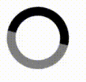

## CSTSI - 4SEM - LPAW - Atividades Aula 01

1) Desenvolva uma animação para carregamento (loader) baseada no gif abaixo:



 Não há restrição quanto a tamanho, cores ou proporções, apens a ideia geral da animação, ou seja, um círculo animado com duas cores pelo menos.


2) Crie uma nova animação baseada na anterior, porém modifique o comportamento da animação para que ela seja executada somente quando o mouse estiver na área pontilhada, como demonstra o gif abaixo:

 

3) Use a pseudo-classe :hover e a propriedade animation para cria a animação de barra de carregamento (load bar) conforme a ilustração abaixo: 


4) Modifique o exemplo de sprites do duende (goblin) ajustando os valores para uma imagem dez vezes maior ([big-goblin](https://i.ibb.co/rdb23sk/goblin-big.png)), e reproduza a animação da figura abaixo:


A animação não deverá estar em loop, até porque será preciso criar mais de uma animação e sincronizá-las.

Use esta imagem: [big-goblin](https://i.ibb.co/rdb23sk/goblin-big.png) e esta estrutura HTML:

```html:
<div class="container">
    <div class="goblin-down"></div>
    <div class="goblin-right"></div>
    <div class="goblin-up"></div>
    <div class="goblin-left"></div>
</div>
```

5) 